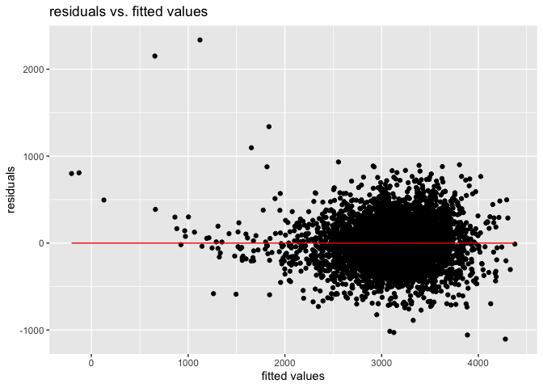
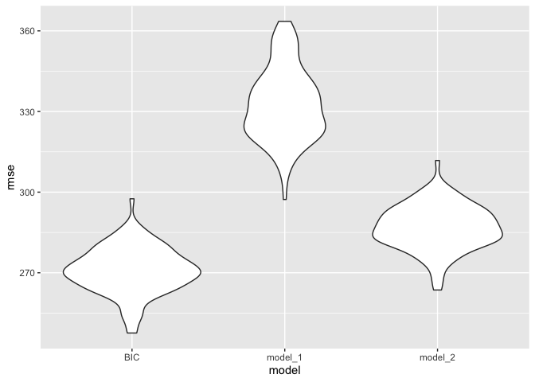
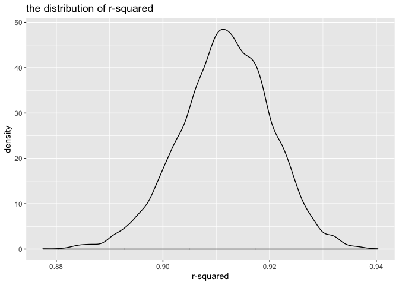
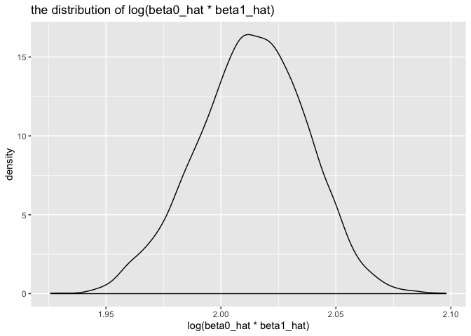

p8105\_hw6\_wz2506
================
Weiran Zhang
11/24/2019

**Problem 1**

Load and clean the data

``` r
##Load and clean the dataset
birthweight = read_csv("/Users/weiranzhang/Downloads/birthweight.csv") %>% 
janitor::clean_names() %>% 
  mutate(babysex = factor(recode(babysex,"1" = "male","2" = "famle" )),
        frace = factor(recode(frace,"1" = "White","2" = "Black" ,"3" = "Asian", "4"= "Puerto Rican","8"  = "Other", "9" = "Unknown")),
        mrace = factor(recode(mrace,"1" = "White","2" = "Black" ,"3" = "Asian", "4"= "Puerto Rican","8"  = "Other")),
        malform = factor(recode(malform,"0" = "absent","1" = "present")))
```

    ## Parsed with column specification:
    ## cols(
    ##   .default = col_double()
    ## )

    ## See spec(...) for full column specifications.

``` r
anyNA(birthweight) ##check for missing data
```

    ## [1] FALSE

``` r
birthweight
```

    ## # A tibble: 4,342 x 20
    ##    babysex bhead blength   bwt delwt fincome frace gaweeks malform menarche
    ##    <fct>   <dbl>   <dbl> <dbl> <dbl>   <dbl> <fct>   <dbl> <fct>      <dbl>
    ##  1 famle      34      51  3629   177      35 White    39.9 absent        13
    ##  2 male       34      48  3062   156      65 Black    25.9 absent        14
    ##  3 famle      36      50  3345   148      85 White    39.9 absent        12
    ##  4 male       34      52  3062   157      55 White    40   absent        14
    ##  5 famle      34      52  3374   156       5 White    41.6 absent        13
    ##  6 male       33      52  3374   129      55 White    40.7 absent        12
    ##  7 famle      33      46  2523   126      96 Black    40.3 absent        14
    ##  8 famle      33      49  2778   140       5 White    37.4 absent        12
    ##  9 male       36      52  3515   146      85 White    40.3 absent        11
    ## 10 male       33      50  3459   169      75 Black    40.7 absent        12
    ## # … with 4,332 more rows, and 10 more variables: mheight <dbl>,
    ## #   momage <dbl>, mrace <fct>, parity <dbl>, pnumlbw <dbl>, pnumsga <dbl>,
    ## #   ppbmi <dbl>, ppwt <dbl>, smoken <dbl>, wtgain <dbl>

Propose a regression model

By BIC model-building process

``` r
##Fist check the full model
full_model = lm(bwt ~ ., data = birthweight)
summary(full_model)
```

    ## 
    ## Call:
    ## lm(formula = bwt ~ ., data = birthweight)
    ## 
    ## Residuals:
    ##      Min       1Q   Median       3Q      Max 
    ## -1097.68  -184.86    -3.33   173.09  2344.15 
    ## 
    ## Coefficients: (3 not defined because of singularities)
    ##                     Estimate Std. Error t value Pr(>|t|)    
    ## (Intercept)       -6306.8346   659.2640  -9.566  < 2e-16 ***
    ## babysexmale         -28.7073     8.4652  -3.391 0.000702 ***
    ## bhead               130.7781     3.4523  37.881  < 2e-16 ***
    ## blength              74.9536     2.0217  37.075  < 2e-16 ***
    ## delwt                 4.1007     0.3948  10.386  < 2e-16 ***
    ## fincome               0.2898     0.1795   1.614 0.106551    
    ## fraceBlack           -6.9048    78.8349  -0.088 0.930210    
    ## fraceOther          -16.9392    97.5932  -0.174 0.862212    
    ## fracePuerto Rican   -68.2323    78.4692  -0.870 0.384599    
    ## fraceWhite          -21.2361    69.2960  -0.306 0.759273    
    ## gaweeks              11.5494     1.4654   7.882 4.06e-15 ***
    ## malformpresent        9.7650    70.6259   0.138 0.890039    
    ## menarche             -3.5508     2.8951  -1.226 0.220083    
    ## mheight               9.7874    10.3116   0.949 0.342588    
    ## momage                0.7593     1.2221   0.621 0.534418    
    ## mraceBlack          -60.0488    80.9532  -0.742 0.458266    
    ## mracePuerto Rican    34.9079    80.9481   0.431 0.666317    
    ## mraceWhite           91.3866    71.9190   1.271 0.203908    
    ## parity               95.5411    40.4793   2.360 0.018307 *  
    ## pnumlbw                   NA         NA      NA       NA    
    ## pnumsga                   NA         NA      NA       NA    
    ## ppbmi                 4.3538    14.8913   0.292 0.770017    
    ## ppwt                 -3.4716     2.6121  -1.329 0.183913    
    ## smoken               -4.8544     0.5871  -8.269  < 2e-16 ***
    ## wtgain                    NA         NA      NA       NA    
    ## ---
    ## Signif. codes:  0 '***' 0.001 '**' 0.01 '*' 0.05 '.' 0.1 ' ' 1
    ## 
    ## Residual standard error: 272.5 on 4320 degrees of freedom
    ## Multiple R-squared:  0.7183, Adjusted R-squared:  0.717 
    ## F-statistic: 524.6 on 21 and 4320 DF,  p-value: < 2.2e-16

``` r
full_model %>% 
  broom::tidy() %>% 
  select(term, estimate, p.value) %>% 
  knitr::kable()
```

| term              |       estimate |   p.value |
| :---------------- | -------------: | --------: |
| (Intercept)       | \-6306.8345949 | 0.0000000 |
| babysexmale       |   \-28.7073088 | 0.0007021 |
| bhead             |    130.7781455 | 0.0000000 |
| blength           |     74.9535780 | 0.0000000 |
| delwt             |      4.1007326 | 0.0000000 |
| fincome           |      0.2898207 | 0.1065513 |
| fraceBlack        |    \-6.9048265 | 0.9302099 |
| fraceOther        |   \-16.9391876 | 0.8622120 |
| fracePuerto Rican |   \-68.2323428 | 0.3845988 |
| fraceWhite        |   \-21.2361118 | 0.7592729 |
| gaweeks           |     11.5493872 | 0.0000000 |
| malformpresent    |      9.7649680 | 0.8900388 |
| menarche          |    \-3.5507723 | 0.2200827 |
| mheight           |      9.7874130 | 0.3425881 |
| momage            |      0.7593479 | 0.5344182 |
| mraceBlack        |   \-60.0487959 | 0.4582660 |
| mracePuerto Rican |     34.9078811 | 0.6663169 |
| mraceWhite        |     91.3866079 | 0.2039079 |
| parity            |     95.5411137 | 0.0183069 |
| ppbmi             |      4.3537865 | 0.7700173 |
| ppwt              |    \-3.4715550 | 0.1839131 |
| smoken            |    \-4.8543629 | 0.0000000 |

By BIC model selection criterion

``` r
BIC_model = step(full_model, direction = "backward",
                k = log(nrow(birthweight)), trace = FALSE)
summary(BIC_model)
```

    ## 
    ## Call:
    ## lm(formula = bwt ~ babysex + bhead + blength + delwt + gaweeks + 
    ##     mheight + mrace + ppwt + smoken, data = birthweight)
    ## 
    ## Residuals:
    ##      Min       1Q   Median       3Q      Max 
    ## -1104.52  -183.71    -2.92   174.58  2336.55 
    ## 
    ## Coefficients:
    ##                     Estimate Std. Error t value Pr(>|t|)    
    ## (Intercept)       -6139.8824   141.9348 -43.258  < 2e-16 ***
    ## babysexmale         -28.9272     8.4577  -3.420 0.000631 ***
    ## bhead               131.1745     3.4460  38.065  < 2e-16 ***
    ## blength              74.7285     2.0187  37.018  < 2e-16 ***
    ## delwt                 4.1053     0.3921  10.471  < 2e-16 ***
    ## gaweeks              11.4086     1.4579   7.825 6.32e-15 ***
    ## mheight               6.8133     1.7803   3.827 0.000132 ***
    ## mraceBlack          -67.3273    42.3562  -1.590 0.112009    
    ## mracePuerto Rican   -28.3684    45.3693  -0.625 0.531822    
    ## mraceWhite           78.1687    42.3138   1.847 0.064764 .  
    ## ppwt                 -2.6726     0.4274  -6.253 4.40e-10 ***
    ## smoken               -4.8782     0.5858  -8.327  < 2e-16 ***
    ## ---
    ## Signif. codes:  0 '***' 0.001 '**' 0.01 '*' 0.05 '.' 0.1 ' ' 1
    ## 
    ## Residual standard error: 272.5 on 4330 degrees of freedom
    ## Multiple R-squared:  0.7175, Adjusted R-squared:  0.7168 
    ## F-statistic: 999.9 on 11 and 4330 DF,  p-value: < 2.2e-16

``` r
BIC_model %>% 
  broom::tidy() %>% 
  select(term, estimate, p.value) %>% 
  knitr::kable()
```

| term              |      estimate |   p.value |
| :---------------- | ------------: | --------: |
| (Intercept)       | \-6139.882420 | 0.0000000 |
| babysexmale       |   \-28.927218 | 0.0006315 |
| bhead             |    131.174549 | 0.0000000 |
| blength           |     74.728511 | 0.0000000 |
| delwt             |      4.105313 | 0.0000000 |
| gaweeks           |     11.408645 | 0.0000000 |
| mheight           |      6.813279 | 0.0001316 |
| mraceBlack        |   \-67.327275 | 0.1120094 |
| mracePuerto Rican |   \-28.368369 | 0.5318225 |
| mraceWhite        |     78.168678 | 0.0647638 |
| ppwt              |    \-2.672565 | 0.0000000 |
| smoken            |    \-4.878211 | 0.0000000 |

Description of modeling process: The model-building process is based on
BIC (Bayesian information criterion) which is a model selection method
based on finite set of models and lower BIC value indicates a better
model. So the best model we got by the BIC selection method shows that
baby’s sex, baby’s head circumference at birth, baby’s length at birth,
mother’s weight at delivery, gestational age in weeks, mother’s height,
mother’s race, mother’s pre-pregnancy weight and average nomberof
cigarettes smoked per day during pregnancy are appropriate predictors of
the child’s birth weight.

Plot of model residuals against fitted values

``` r
birthweight %>% 
  modelr::add_residuals(BIC_model) %>% 
  modelr::add_predictions(BIC_model) %>% 
  ggplot(aes(x = pred, y = resid)) + 
  geom_point() + geom_line( y = 0, color = "red") +
  labs(
    x = "fitted values",
    y = "residuals",
    title = "residuals vs. fitted values"
  ) 
```

<!-- -->

Compare model with two others model 1: length at birth and gestational
age as predictors

``` r
model_1 = lm(bwt ~ blength + gaweeks, data = birthweight) 

model_1 %>% 
  broom::tidy() %>% knitr::kable()
```

| term        |     estimate | std.error |  statistic | p.value |
| :---------- | -----------: | --------: | ---------: | ------: |
| (Intercept) | \-4347.66707 | 97.958360 | \-44.38281 |       0 |
| blength     |    128.55569 |  1.989891 |   64.60439 |       0 |
| gaweeks     |     27.04673 |  1.717930 |   15.74379 |       0 |

model 2: head circumference, length, sex, and all
interactions

``` r
model_2 = lm(bwt ~ bhead*blength + bhead*babysex + blength*babysex + bhead*babysex*blength,data = birthweight)

model_2 %>% 
  broom::tidy() %>% knitr::kable()
```

| term                      |      estimate |    std.error |   statistic |   p.value |
| :------------------------ | ------------: | -----------: | ----------: | --------: |
| (Intercept)               |  \-801.948671 | 1102.3077046 | \-0.7275180 | 0.4669480 |
| bhead                     |   \-16.597546 |   34.0916082 | \-0.4868514 | 0.6263883 |
| blength                   |   \-21.645964 |   23.3720477 | \-0.9261475 | 0.3544209 |
| babysexmale               | \-6374.868351 | 1677.7669213 | \-3.7996150 | 0.0001469 |
| bhead:blength             |      3.324444 |    0.7125586 |   4.6655020 | 0.0000032 |
| bhead:babysexmale         |    198.393181 |   51.0916850 |   3.8830816 | 0.0001047 |
| blength:babysexmale       |    123.772887 |   35.1185360 |   3.5244319 | 0.0004288 |
| bhead:blength:babysexmale |    \-3.878053 |    1.0566296 | \-3.6702106 | 0.0002453 |

Cross-validation

``` r
cv_df =
  modelr::crossv_mc(birthweight, 100) %>% 
  mutate(
    train = map(train, as_tibble),
    test = map(test, as_tibble)) %>% 
  mutate(BIC_mod = map(train, ~BIC_model),
         model1_mod = map(train, ~model_1),
         model2_mod = map(train, ~model_2)) %>% 
  mutate(rmse_BIC = map2_dbl(BIC_mod, test, ~modelr::rmse(model = .x, data = .y)),
         rmse_model_1= map2_dbl(model1_mod, test, ~modelr::rmse(model = .x, data = .y)),
         rmse_model_2 = map2_dbl(model2_mod, test, ~modelr::rmse(model = .x, data = .y))
         )

cv_df %>% 
  select(starts_with("rmse")) %>% 
pivot_longer(
    everything(),
    names_to = "model", 
    values_to = "rmse",
    names_prefix = "rmse_") %>% 
  mutate(model = fct_inorder(model)) %>% 
  ggplot(aes(x = model, y = rmse)) + geom_violin()
```

<!-- -->

From the plot of rmse distribution, we can see that the rmse for model
with only length at birth and gestational age as predictors has the
highest rmse value among all three models, and the model with head
circumference, length, sex and all interactions are the second highest
and the BIC selected model has the lowest rmse which means it is the
best model among all those three models.

**Problem 2**

``` r
weather_df = 
  rnoaa::meteo_pull_monitors(
    c("USW00094728"),
    var = c("PRCP", "TMIN", "TMAX"), 
    date_min = "2017-01-01",
    date_max = "2017-12-31") %>%
  mutate(
    name = recode(id, USW00094728 = "CentralPark_NY"),
    tmin = tmin / 10,
    tmax = tmax / 10) %>%
  select(name, id, everything())
```

    ## Registered S3 method overwritten by 'crul':
    ##   method                 from
    ##   as.character.form_file httr

    ## Registered S3 method overwritten by 'hoardr':
    ##   method           from
    ##   print.cache_info httr

    ## file path:          /Users/weiranzhang/Library/Caches/rnoaa/ghcnd/USW00094728.dly

    ## file last updated:  2019-09-26 10:27:22

    ## file min/max dates: 1869-01-01 / 2019-09-30

``` r
boot_straps = 
  weather_df %>% 
  modelr::bootstrap(n = 5000)

bootstrap_results_1 = 
  boot_straps %>% 
  mutate(
    models = map(strap, ~lm(tmax ~ tmin, data = .x) ),
    results = map(models, broom::tidy),
    variables = map(models, broom::glance)) %>% 
  select(-strap, -models) %>% 
  unnest(results,variables) 
```

    ## Warning: unnest() has a new interface. See ?unnest for details.
    ## Try `df %>% unnest(c(results, variables))`, with `mutate()` if needed

Plot of \(\hat{r}^2\)

``` r
bootstrap_results_1 %>% 
  ggplot(aes(x = r.squared))+ geom_density()+
  labs(title = "the distribution of r-squared",
       x = "r-squared")
```

<!-- -->

From the plot, we can see a little bit left-skewed plot with light tail
to the low values that may indicates that some outliers are included in
the sample.

95% confidence interval for \(\hat{r}^2\)

``` r
CI_1 = 
  bootstrap_results_1 %>% 
  filter(term == "tmin") %>% 
  pull(r.squared) %>% 
  quantile(c(0.025, 0.975))

CI_1
```

    ##      2.5%     97.5% 
    ## 0.8940676 0.9277828

The 95% confidence interval for \(\hat{r}^2\) is (0.8941060, 0.9270013)

Plot of \(log(\hat{\beta_0}*\hat{\beta_1})\)

``` r
bootstrap_results_2 =
  bootstrap_results_1 %>% 
  select(.id, term, estimate) %>% 
  pivot_wider(
    id_cols = .id,
    values_from = estimate,
    names_from = term
  ) %>% 
  janitor::clean_names() %>% 
  mutate(log_value = log(intercept*tmin)) 

bootstrap_results_2 %>% 
  ggplot(aes(x = log_value))+ geom_density()+
  labs(title = "the distribution of log(beta0_hat * beta1_hat)",
       x = "log(beta0_hat * beta1_hat)")
```

<!-- -->

From the plot, we can see that a close to bell-shaped normal distributed
plot which means that the distribution of
\(log(\hat{\beta_0}*\hat{\beta_1})\) basically follows normal
distribution.

``` r
CI_2 = 
  bootstrap_results_2 %>% 
  pull(log_value) %>% 
  quantile(c(0.025, 0.975))

CI_2
```

    ##     2.5%    97.5% 
    ## 1.964900 2.057267

The 95% confidence interval for \(log(\hat{\beta_0}*\hat{\beta_1})\) is
(1.965644, 2.059312)
